<h1 align="center">RIDGEWAY FITNESS</h1>

[View my live project here](https://natkewe.github.io/ridgewayfitness/)

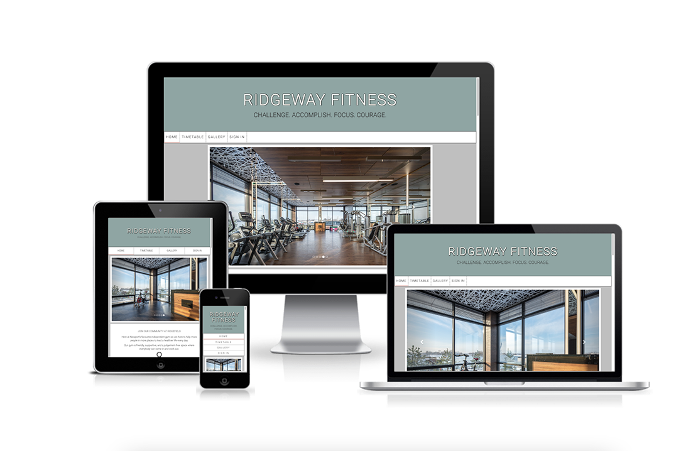  
This image is from [Am I responsive](https://ui.dev/amiresponsive)

Created to provide information on what is on offer at the gym, the environment inside the gym itself, and easy links to find out what is on at the gym and how to join.

This website is made up of the following sections:

1. Nav bar and carousel images
2. Two text boxes listing the Facilities and Equipment at the gym
3. Map of where to find us
4. Two text boxes listing the Opening hours and Address information
5. Information row telling users that we offer classes and providing a link to the classes page
6. Two text boxes with links to the sign-in page, and listing the Free Pass information and Full Membership information
7. Contact us form box

8. Gallery page with multiple photos

9. Sign In page with two boxes for logging in and creating a new account

10. Timetable page with a timetable for classes and images of what some of the classes involve

The business goals for this website:

1. To showcase the inside of the gym and users having fun
2. To help users find where we are located and times we are open
3. To draw in first-time visitors to try out the gym or signing up for membership
4. To show the state-of-the-art equipment and classes we offer

The user goals of this website:

1. As a first-time visitor, I want to be able to see images of the inside of the gym and some of the rooms.
2. As a first-time visitor, I want to be able to find what equipment they have at the gym, and what kind of facilities they have there.
3. As a first-time visitor, I want to be able to see where the gym is located and have a map to click on so I can see straight away whether the gym is close enough to visit.
4. As a first-time visitor and returning visitor, I want to be able to easily find the full address and contact information of the gym, such as the email address and opening hours so if I wanted to contact the gym or know what time they close.
5. As a first-time visitor, I want to be able to see how I can come down and try the gym, or how much to join the club.
6. As a first-time or frequent visitor to the site, I want to be able to find the classes available and what times they are on.
7. As a returning visitor, I want to be able to find where to create an account and then log in as a frequent visitor.
8. As a first-time visitor, I would like to see other people in the gym who are members or who have used the gym, so I can get an idea of what the gym is like to train in.

----

<h2 align="center">(UX)</h2>

## Strategy

### Target audiance

- Users who are new or exercise often, who want to see if there is a gym close to them with the right facilities for them.
- Users who are looking for certain machines that they like to use, and would be aiming to find this out before visiting.
- Regular exercisers who are looking to move to a new gym.
- Users of any age who are looking to start getting healthy and start exercising in a gym for the first time.
- Local people in the area if they have walked past the gym, or office/shop workers who have noticed the gym in the area.
- I feel prospective users may make more of an emotional purchase with us through the site, rather than just focussing on the prices or by impulse.

## Scope

After looking at the desired user and business goals, I am including the following on the site:

- Nav bar with easy-to-read links to the Gallery page, Timetable page and Sign In page
- Information on the club being an inclusive and friendly place to train
- Links from the Home page which explain there are classes
- Information boxes to show the type of equipment and facilities on offer
- Images of people having fun exercising, and aim to inspire users to get fit
- Timetable page link with a clear and easy-to-read timetable and some information on what types of classes are
- Links to the social media pages for the gym
- A sign-up and log-in page with easy to navigate information on how to join us
- A map of where to find the club near the very top of the page
- Easy to find membership box options and how much it is to join

## Structure

I opted for the website to be over multiple pages, however, the main Home page is scrollable with more information whereas the other pages purely show the Timetable, sign-in boxes or gallery images.
I chose to have the sign-in page separate for ease of use if someone has viewed the website before and is now ready to sign up with us and therefore gives them direct access to this page. Also with existing members, it gives them direct access to log into their account without having to navigate through the main Home page.
The Home page is structured to show text boxes floating horizontally down the page when viewed on a larger screen, and the boxes are broken up with information row boxes telling users about the club itself or that the is a classes page and providing a link to this.
Despite being in row blocks with a background, I think this is easy for users to navigate and the information flows down the page.

## Skeleton

### Original Wireframes

- Home page wireframe - [View](documents/wireframe-home-page.png)

- Timetable page wireframe - [View](documents/wireframe-timetable-page.png)

- Sign In page wireframe -   [View](documents/wireframe-signin-page.png)

- Membership page wireframe - [View](documents/wireframe-membership-page.png)

## Surface

- There are three main colours used throughout my site, these were taken from [Color Adobe](https://color.adobe.com/explore)

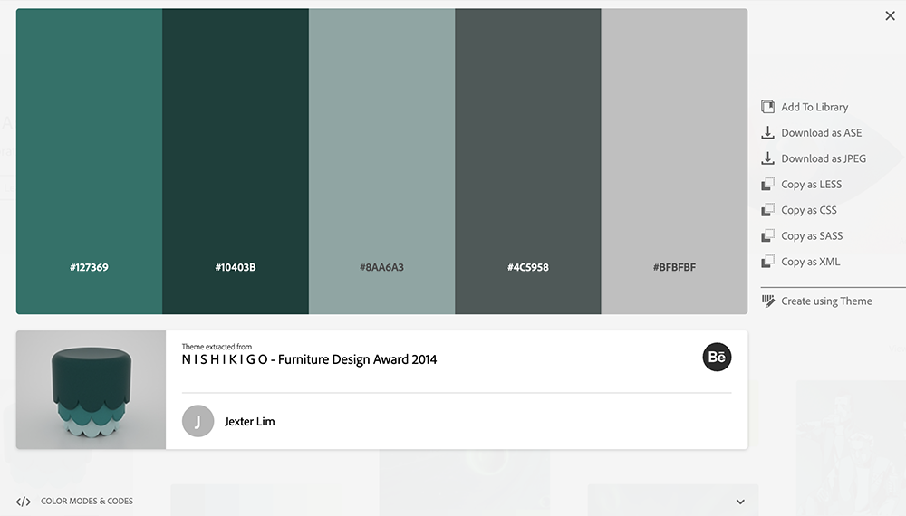

----

<h2 align="center">FEATURES</h2>

This is a fully responsive website created mobile-first and is divided into several sections of information on the Home page, and three links to other pages on the site.
The images throughout the site were taken from both [Pexels](https://www.pexels.com/) and [Adobe Stock Images](https://stock.adobe.com/uk/photos) and the font I chose for the site had been Roboto from [Google Fonts](https://fonts.google.com/specimen/Roboto?query=ro)

## Navbar

- The navbar is placed horizontally under the main heading, and consists of 4-page links taking you to the Home page, Gallery page, Sign In page and Timetable page. The navbar is fully responsive and when viewed on smaller screens these take up 100% of the width and stack onto the top of each other. The navbar incorporates a pink line under the page you are currently looking on, this pink is also then carried across the site with other links.

## Carousel

- The carousel offers the users 4 main full-width images showing people working out and having fun in the gym, and also of the inside of the gym itself and the equipment. The carousel is auto-rotating through the five images, and there is also a scroll bar on either side of the images and also a clickable dot so users can go back to the previous image. The height of the carousel is mirrored throughout the site for the other main page images, and also is fully responsive to downsize when viewed on smaller devices. The carousel code that I used had been taken from Bootstrap.

## Facilities and Equipment boxes

- The facilities are equipment that boxes offer a list layout of the types of equipment at the gym, and also the facilities on offer. This is easy to read and tells users the direct information they are looking for as to what is available. There is also an image above both of the boxes and it is signposted with a heading.

## Map

- I have featured a full-width map with a white border to continue the style of the site, and this is easy to read and for users to click on to find the club.

## Opening hours and Address boxes

- I have again taken both boxes for opening hours and address and put these as horizontal boxes when on a larger screen. They have the same light background and clear easy-to-read the black text in uppercase. I also included icons from 'Feather' to use next to the address and contact number information, this helps to even up the box on the right-hand side.

## Membership boxes

- The two membership option boxes are next to each other horizontally when viewed on larger screens, and feature minimal text and information to highlight the needed information only and not overload the user.
I have included a link on both boxes which takes you to the sign-up page and instructs you where to create an account to join.
The background colour was taken from the colour palette and is the darkest background on the site and I feel helps to break up the other lighter colour boxes around these.

## Contact us box

- I have included a contact us box, which gives users or members a chance to contact us regarding any problems they have navigating the site, something they found when using the gym or a question about joining. I think it helps to show that the gym wants to hear from its users or visitors and would also help to identify any gaps in the information on the site for future releases.

## Sign In page

- The sign in page is easy to use, the colours are copied throughout the site from the colour palette, and gives easy-to-read guidance on logging into your account or how to create an account with us.

## Timetable page

- The timetable page shows easily the classes on offer and when during the week that these are on. The sliding bar also appears when the site is viewed on smaller devices to help scroll the timetable from right to left.
There are also four boxes with images under the timetable which give some guidance on what some of these classes are and why you may choose to go to them.

### Gallery page

- The gallery page offers a glimpse into the types of users and equipment found in the gym. All the images are taken inside the gym and they show users and members happy and enjoying their workouts. The images also show clean gym equipment and a brightly lit and well-maintained gym facility.

----

<h2 align="center">TESTING</h2>

### User Stories:

1. As a first-time visitor, I want to be able to see images of the inside of the gym and some of the rooms.

I have created a Carousel rather than a still image on the Home page so you can see 5 large images of inside the gym, and also some people working out in the gym itself.
The 5 images are on a rotation and also scattered around the site are other large images of inside the gym.

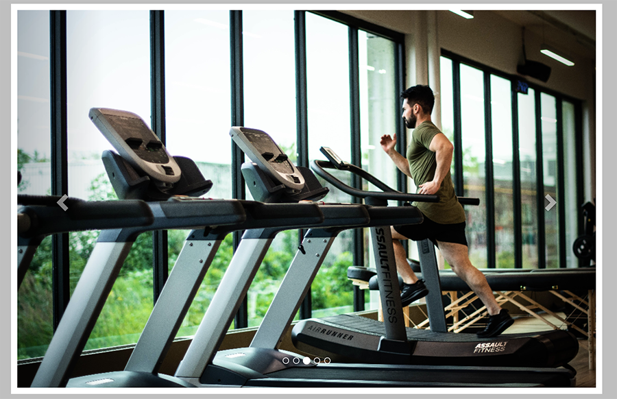

2. As a first-time visitor, I want to be able to find what equipment they have at the gym, and what kind of facilities they have there.

The Equipment and Facilities boxes are the first things you come across when loading up my site, it is easy to read the equipment that is in the gym and the facilities. Visitors would then be shown images throughout the site where they would be able to see the kinds of machines, studios and equipment that had been mentioned on the list.

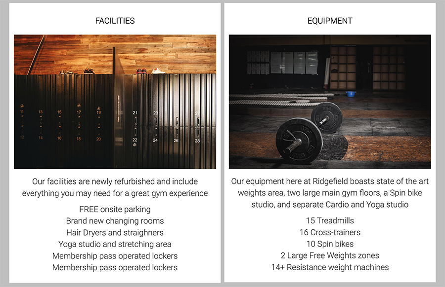

3. As a first-time visitor, I want to be able to see where the gym is located and have a map to click on so I can see straight away whether the gym is close enough to visit. 

The map to find the gym is 100% wide and slim so it stands out and is easy to find and see at the top of the Home page. I have made this with a simple border to match other boxes on the site, and as it is a map that is clickable I have not signposted this with a heading.

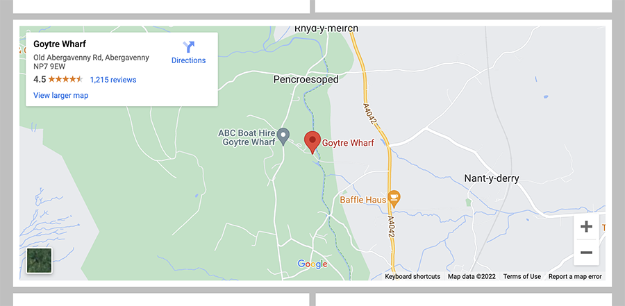

4. As a first-time visitor and returning visitor, I want to be able to easily find the full address and contact information of the gym, such as the email address and opening hours so if I wanted to contact the gym or know what time they close.

As you scroll under the map on the Home page, you will then easily find the contact information such as telephone number, and also the opening hours of the gym. I have these as floating boxes so visitors can easily find all of this information on one horizontal line, or above and below each other when viewed on a mobile device.

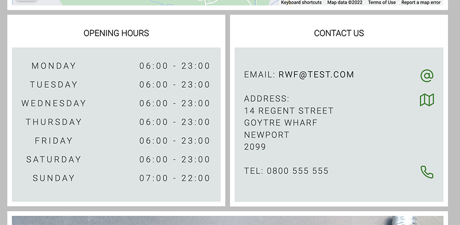

5. As a first-time visitor, I want to be able to see how I can come down and try the gym, or how much to join the club.

To find the type of membership available and being able to visit the gym, this can be found as two horizontal boxes under the contact boxes information. I have these boxes towards the bottom of the site, and to break up having four boxes together when on a larger screen, I have input an image banner in between this.

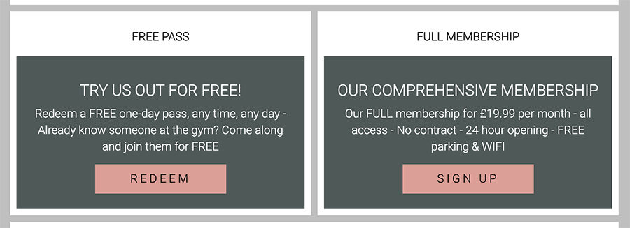

6. As a first-time or frequent visitor to the site, I want to be able to find the classes available and what times they are on.

There is an easy-to-find timetable tab page on the nav bar, which takes you straight to a large timetable and also four boxes where you can find out a little more information on what some of the classes are.
If visitors miss the timetable link on the nav bar, I have a banner image and text halfway down the Home page which asks if you would like to go to a class and provides a link which takes you straight to the Timetable page

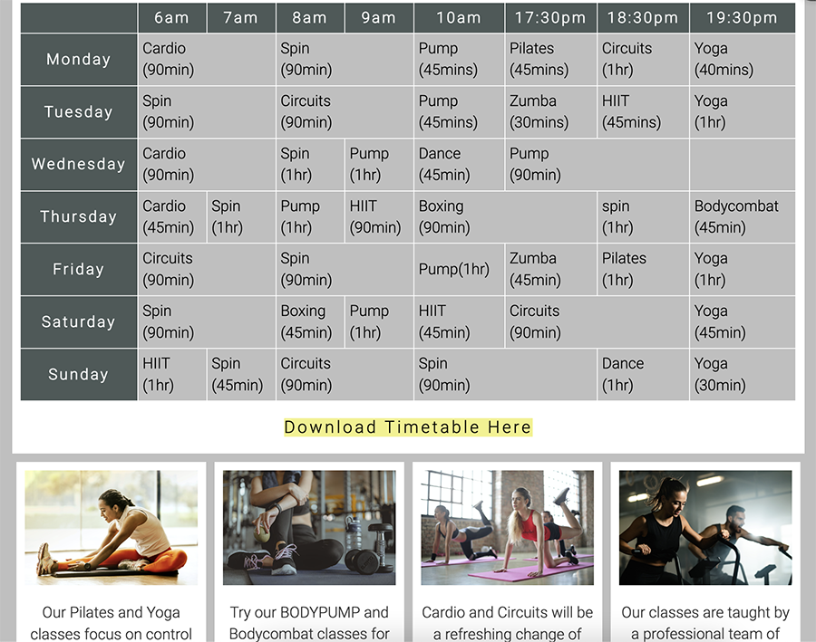

7. As a returning visitor, I want to be able to find where to create an account, and then log in as a frequent visitor.

There is a very clear sign-in tab on the top nav bar when first visiting the Home page, this will then take you to an easy-to-navigate page where the first box shows you that you can log in, and it tells you some information bullet points on what you can view if you log into your account.
The create account box is directly under the login box, and is easy to distinguish the two boxes and the form text inside them. There is also bullet point text next to the create account box which tells you some benefits of signing up, and also information on being able to create an account to join the club or try it for a free day pass.

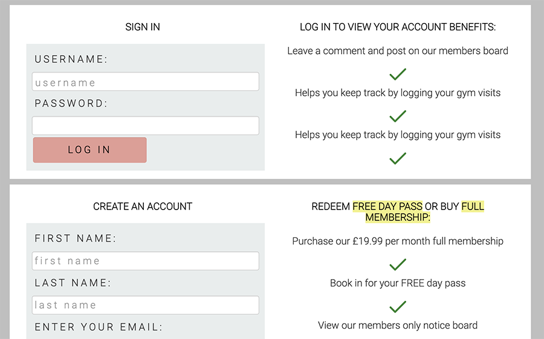

8. As a first-time visitor, I would like to see other people in the gym who are members or who have used the gym, so I can get an idea of what the gym is like to train in.

I have created a gallery page to showcase lots of people exercising and having an enjoyable time at the gym. There are several images throughout the site of people exercising on their own or in a group, how-ever having a whole gallery page helps to motivate new and returning visitors to try out the gym and sign up for a free pass or membership.

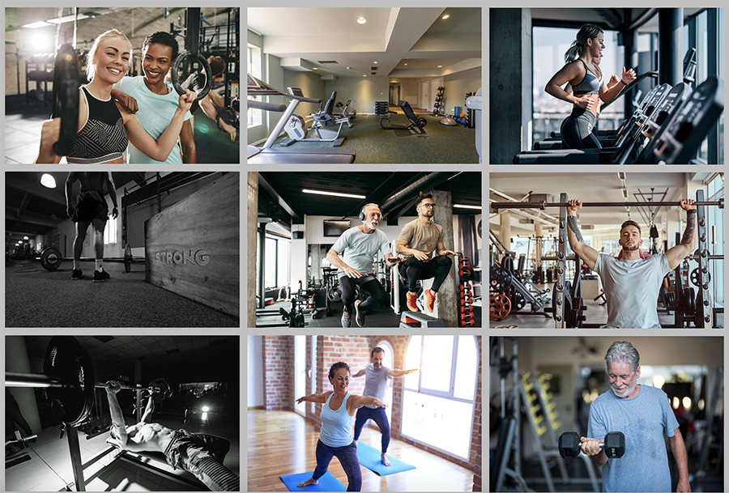

----

<h2 align="center">TECHNOLOGIES USED</h2>

- [HTML](https://developer.mozilla.org/en-US/docs/Web/HTML) (Used as the basic building block for the project and to structure the content)

- [CSS](https://developer.mozilla.org/en-US/docs/Learn/Getting_started_with_the_web/CSS_basics) (Used to style all the web content across the project)

- [Googe Fonts](https://fonts.google.com/) (Is a library of open-source font families via CSS)

- [Google Developer Tools](https://developer.chrome.com/docs/devtools/) (Used to help establish issues, fix bugs, and test the responsiveness of my pages)

- [GitHub](https://github.com/) (Used to store code for the project after being pushed)

- [Git](https://git-scm.com/) (Used for version control by utilising the Gitpod terminal to commit to Git and Push to GitHub)

- [Gitpod](https://www.gitpod.io/) (Used as the development environment)

- [Balsamiq](https://balsamiq.com/wireframes/desktop/) (Is a web-based user interface design tool for creating wireframes or 'mockups' for website design ideas)

- [W3 Schools](https://www.w3schools.com/) (Tutorials, references, and examples to help improve basic understanding of web development)

- [W3C Markup Validation](https://validator.w3.org/#validate_by_input) (Is for the testing of all HTML on the pages throughout my site)

- [W3C CSS Validation](https://jigsaw.w3.org/css-validator/#validate_by_input) (Is for the testing of the CSS throughout my site)

- [Bootstrap](https://getbootstrap.com/docs/5.0/content/typography/) (Is an open-source front-end development framework for the creation of websites and web apps)

- [Adobe Color](https://color.adobe.com/explore) (Create colour palettes with the color wheel or image)

- [Feather Icons](https://feathericons.com/) (A collection of simple open-source icons)

----

## Changes made from original Wireframes:

- Creating a Gallery page. 
I had set on my wireframe and plan to do a membership page, with a sign-up box and a free day pass page. When I had created the sign-in and create account page to mirror the same look and design as the sign-in page, I realised that the membership page was best used instead to portray more images of the gym and people using it, as the only other images used were in the carousel where people could see what it was like at the gym. I also thought that as it is a simple sign-up for the free pass and the one membership on offer, I would ask members to ‘create an account’ to be able to purchase and sign-up for the free pass.

- On my main page, I realised that combining the ‘equipment and facilities’ box and having the map next to it did not work. It made the map appear too small when the screen size was reduced and did not look very clear. I changed this by moving the map down below and making it 100% width. I then separated the equipment and facilities into two boxes and floated these next to each other

- When creating the boxes for my sign-in and create account page, I ended up stacking them on top of each other instead of in two columns. I did this because I had originally planned on having some information underneath the ‘sign-in’ box which would mean it would then be the same height as the ‘create account’ box, as it was quite a lot shorter. I changed this from my original plan as I found the writing did not flow as planned when placed under the sign-in box, and also it resulted in the ‘create account’ box looking quite bare. I changed this to merge the membership page into the same page and list some information for people to learn that they have to ‘create an account’ to redeem a free pass or sign up as a member. I feel it looks cleaner and flows better on the page.

- I had started by adding 8 images under the timetable box, however, I thought this looked quite crowded, and also on smaller screens the photos would scroll for quite a while to get through them. I felt as though 4 was a good number, and it gave me more than enough space to include all of the information about what different classes were.

- I started by having my opening hours box written with paragraph and line breaks, however, I changed this to UL and li when I realised that it was not the right way to use paragraphs. I then had an issue with the opening hours box affecting my UL on my timetable page, so had to make sure I separated them with different IDs.

- I decided to add a ‘container’ around the body of all of my pages as I had originally wanted 'padding' on the left and right margins, however, I ran into difficulty with when the sizes moved down to iPad and mobile phone sizes, as the margins did not line up and made different size gaps. I had read that you can counter-act this with margin 0, however I then found that the 'container' automatically added a large margin around the content, and also centred the body of my page which I really like the effect and also that my images and carousel appear very clear. I have decided to add the container after the heading and nav bar, so this
adds to an effect of the heading stretching with the ‘VW’ of my heading, and it frames the page well.

## Future Updates:

- I felt I used quite a few media breaks (and maybe needed even more) when there could have been an easier way of doing this by starting with a flex grid or a guide on Bootstrap which would help add the media breaks evenly throughout my site. I looked into them at the very start, however I did not feel confident to implement these at the time of first starting.
I would like to fix the responsiveness on the site and create more effective and uniform media breaks or flexs throughout the site.
- New ideas for a future release would be to include more of a members and visitors page, where there is a board of photos that can be posted by both users and staff. There would also be a board where you can leave a comment or review of staff or the gym.

----

<h2 align="center">ISSUES AND BUGS</h2>

1. Lighthouse screenshot of a background colour issue, this had been using the rgba color (76, 89, 88, .8) and it showed as being impossible or difficult for viewers to see the text. I changed this to the colour #4C5958 and also changed the text colour from Black to White to help this stand out even more.  
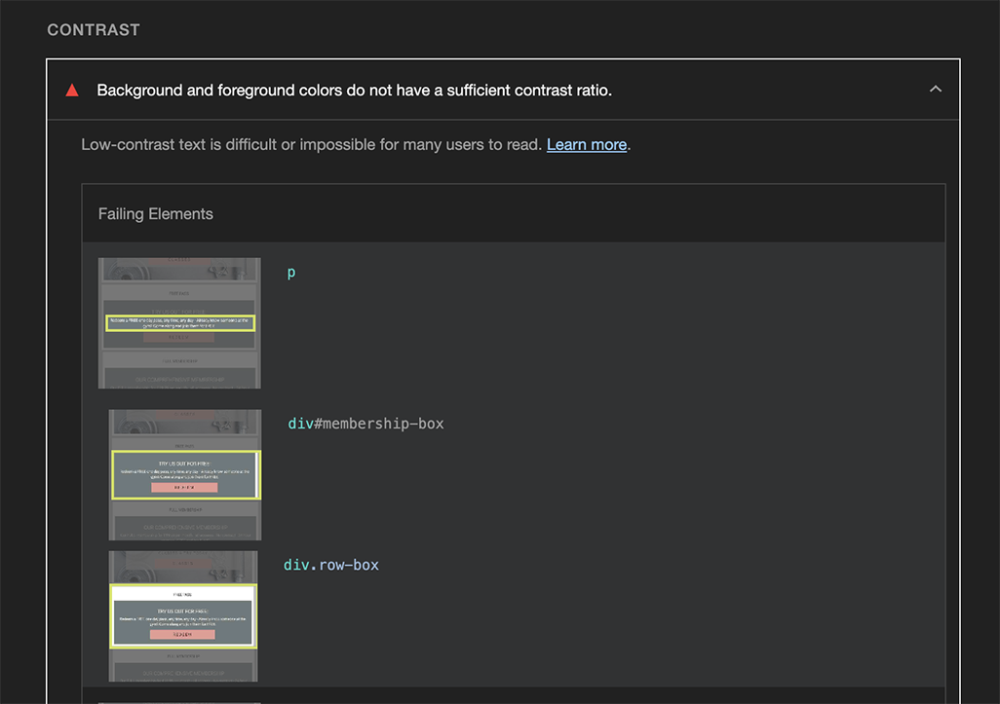

----

2. I had an issue with the Button text not standing out enough against the pink button background. I changed this to Black text and this passed the test afterwards.  
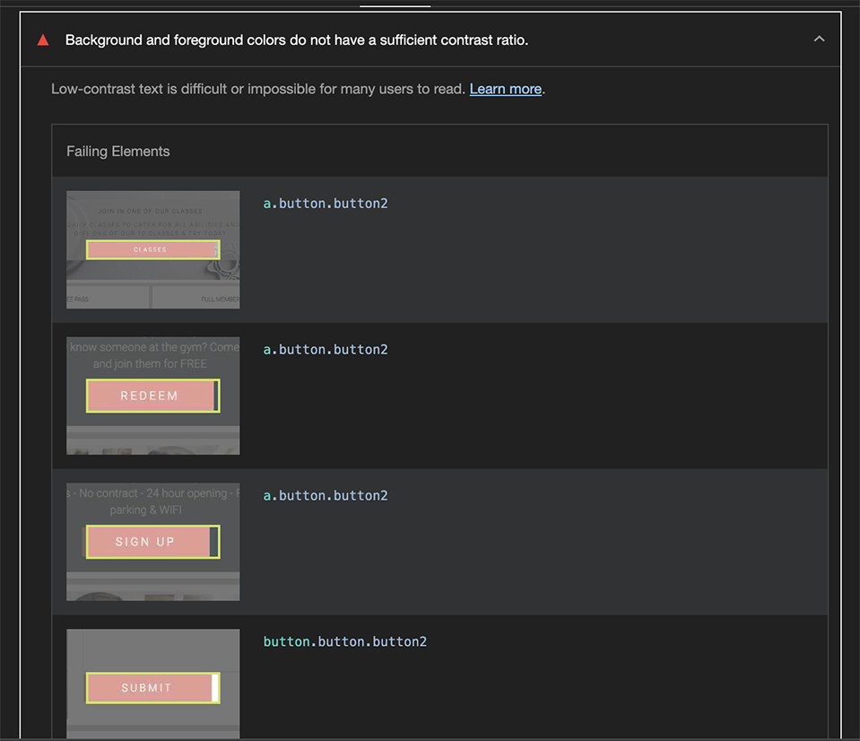

----

3. Issue with image height and width had come up many times when I first ran my code through Lighthouse. I fixed this by adding the correct height and width that my images were after I ran them through Photoshop to change these, I made sure I did not add a % sign or writing pixels, as this also then came up with an issue on Lighthouse.  
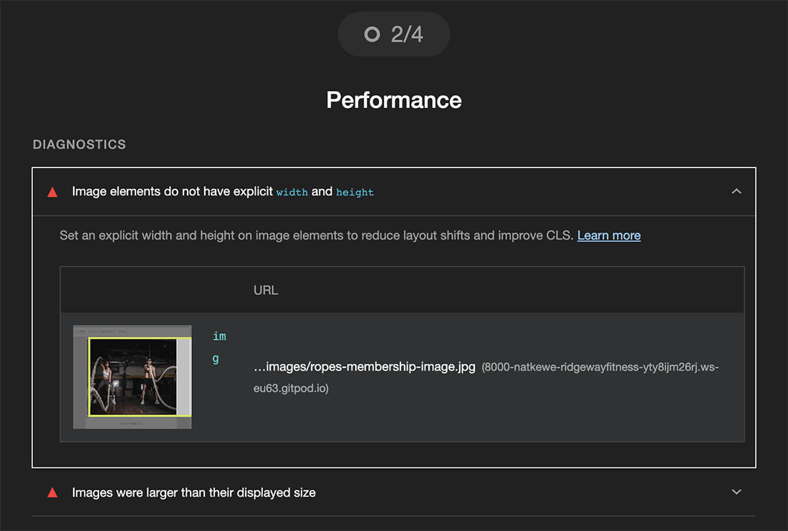

----

4. During the build I had this Warning message arise a lot. I fixed this by putting an ID on my section heading, or I changed the section to a div instead as advised on the warning.  
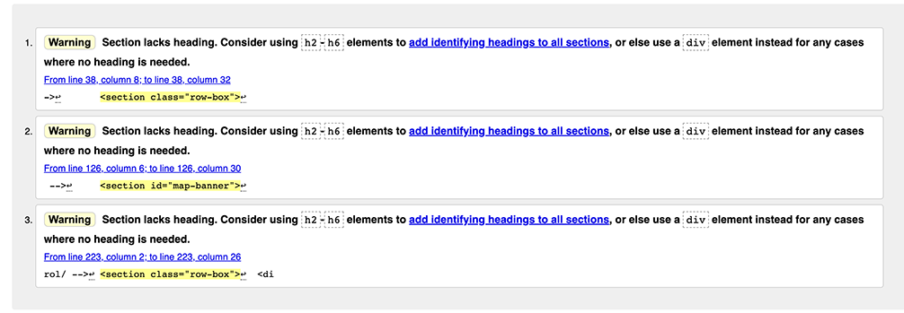

----

5. Running through Lighthouse the issue of meta tags description arose, I fixed this by adding a meta description on my page and a content description. Under this, I also added keywords to help search engines in linking my page to their searches.  
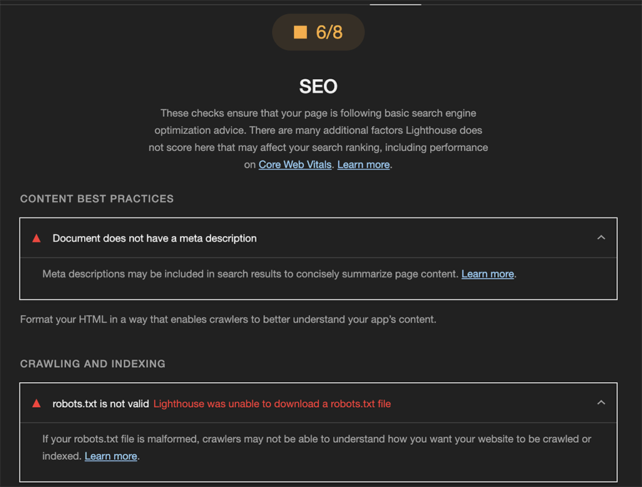

----

6. While running the Home page through, the issue of the text under my header text had been too small a size, I increased the size of the paragraph text and made this Uppercase and font-weight 900. This then passed the test without issue.

7. The 'Contact us' box and the 'hour' box had both flagged up as having a text issue where it was not very easy to read for viewers. I fixed this by adding Uppercase in CSS and also added a line spacing of 2px to help the text be clear to read.

8. Issues arose on the Timetable page where the background colours and text colours did not show up correctly when I ran this through Lighthouse. I fixed this by changing the text colour to Black instead of White and also made the background box slightly lighter for the body of the form so it would stand out a lot more and be easier to read.

9. I had many issues over the site where I noticed stray tags and divs where I did not link these properly, or I had not deleted the closing tag and it had not been leading to any opening tag.

10. When adding the icons from Feather, I originally wanted the ticks and icons in brighter green, however, when running this through Lighthouse I found that they flagged as not showing up properly. I changed this to be a slightly darker green and these still stood out as I wanted against the background of the page.

11. A warning that shows on W3C validator is ‘section does not have heading’ however I have input both id and class into section headings, however they are still showing up that the section should have a header, or else to use a div (but in our lessons, they advised us to use sections, so I have kept these in)

12. An error appeared for the label for my 'create account' box and 'log in' box. This was because I had a 'label for' but I did not have an id on my input tag. This caused several errors.
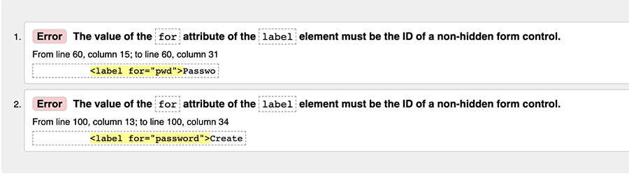

---

<h2 align="center">CODE PASSES - VALIDATOR</h2>

1. Screenshot from Chrome Lighthouse passing the code checker. The score for the performance of 3/4 is due to the height of my images not matching the recommended pxs, however, the height of my images are correct, and I used Photoshop to re-size all of my images to the recommended size to keep quality and help with site loading.
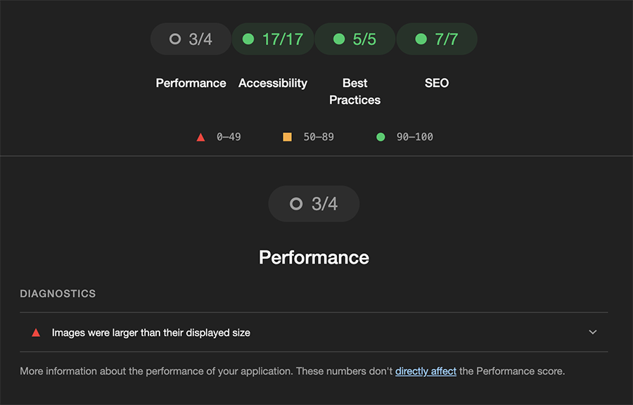

----

2. Screenshot from W3C HTML Validation Service of my HTML code passing without errors
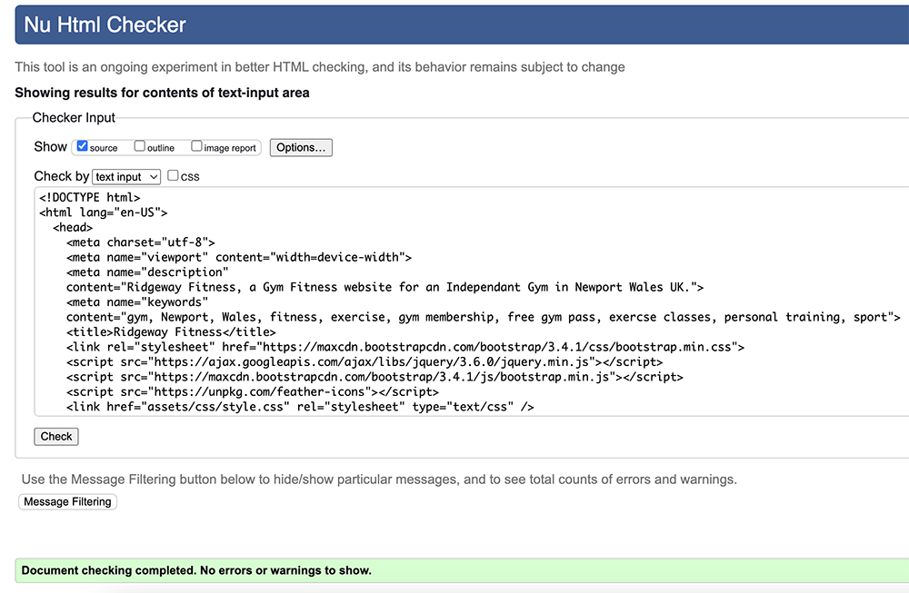

----

3. Screenshot from W3C CSS Validation Service of my CSS code passing without errors
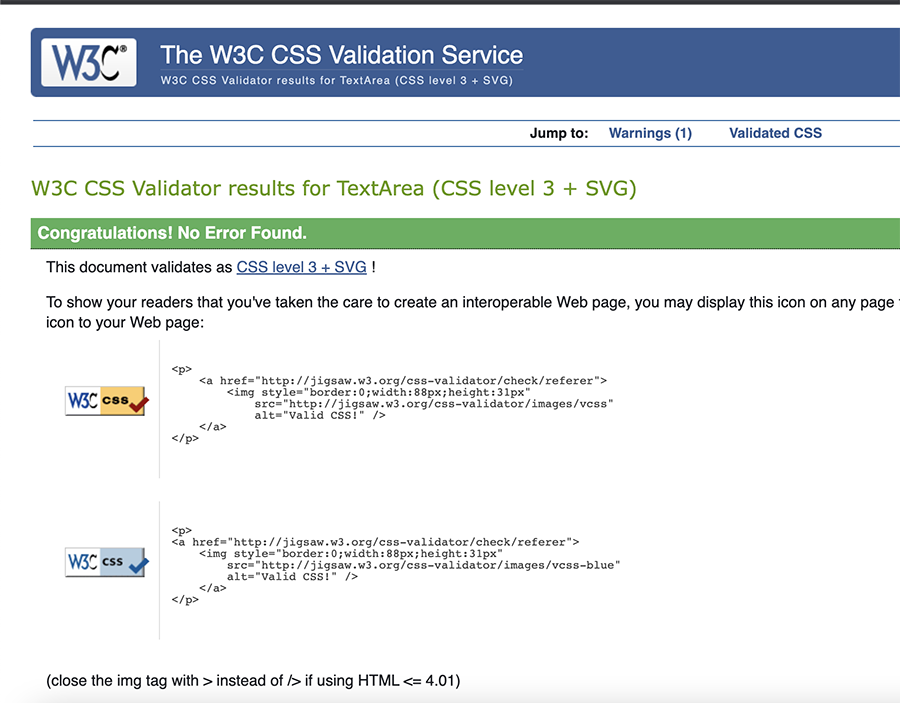

----

<h2 align="center">DEPLOYMENT</H2>

I deployed this website by using GitPages and following the below steps:

GitHub pages deployment

1. Log in to GitHub
2. In your Repository section, select the project repository that you want to deploy
3. In the menu located at the top of this section, click 'Settings'
4. Select 'Pages' on the left-hand menu - this is around halfway down
5. In the source section, select branch 'Master' and save
6. The page is then given a site URL which you will see above the source section, it will look like the following:

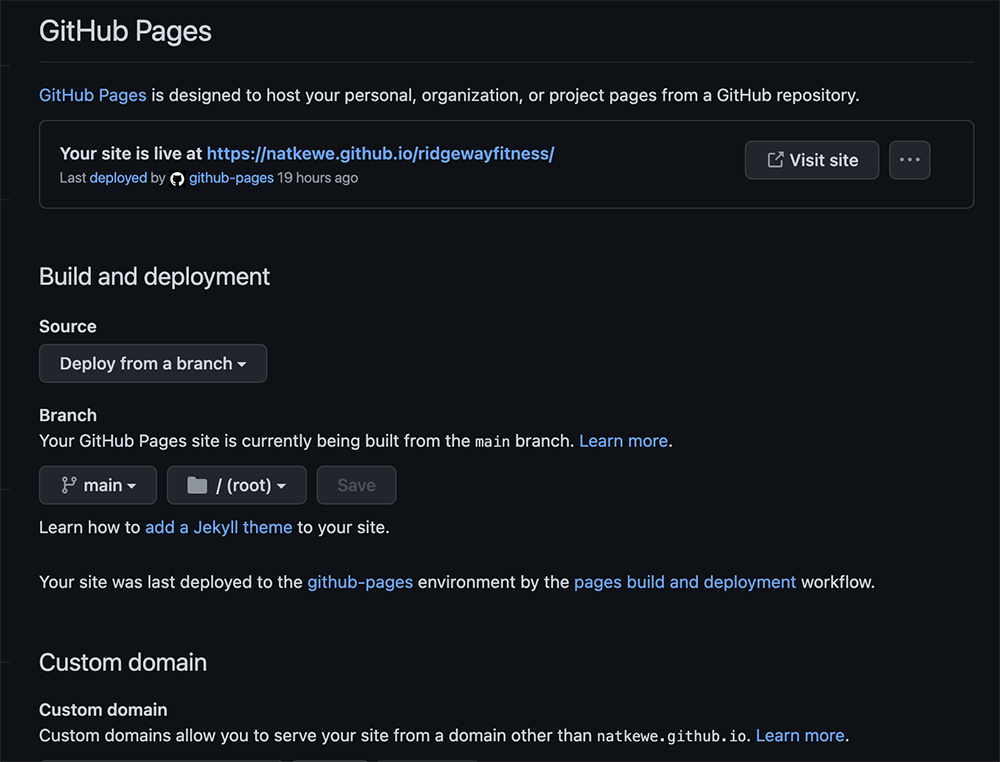

Forking the GitHub Repository

If you want to make changes to your repository without affecting it, you can make a copy of it by 'Forking' it. This ensures your original repository remains unchanged.

1. Find the relevant GitHub repository
2. In the top right corner of the page, click the Fork button (under your account)
3. Your repository has now been 'Forked' and you have a copy to work on
Cloning the GitHub Repository

Cloning your repository will allow you to download a local version of the repository to be worked on. Cloning can also be a great way to backup your work.

1. Find the relevant GitHub repository
2. Press the arrow on the Code button
3. Copy the link that is shown in the drop-down
4. Now open Gitpod & select the directory location where you would like the clone created
5. In the terminal type 'git clone' & then paste the link you copied in GitHub
6. Press enter and your local clone will be created.

----

<h2 align="center">CREDITS</h2>

I have used a number of resources to produce this website, where code has been used found from another source this is credited as a comment within the HTML and CSS files.

The following websites/articles were used for research and guidance:

- [Wireframes](https://balsamiq.com/wireframes/desktop/)

- [Bootstrap](https://getbootstrap.com/docs/5.0/content/typography/) For the Carousel on my Home page I used Bootstrap for this

- [W3 Schools](https://www.w3schools.com/) I used W3 Schools for a lot of guidance while creating my site, also in my navbar and heading

----

## Acknowledgemts

I would like to thank my course mentor Guido Cecilio for his support and feedback throughout the course of my project, and for the helpful advise before submitting this project.

----